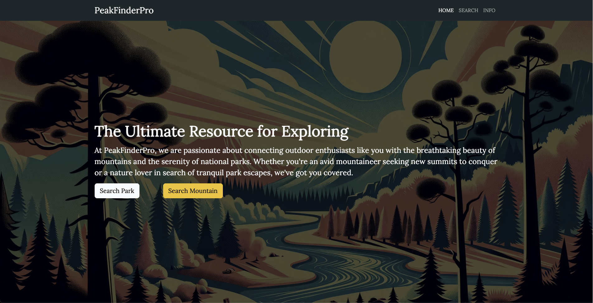
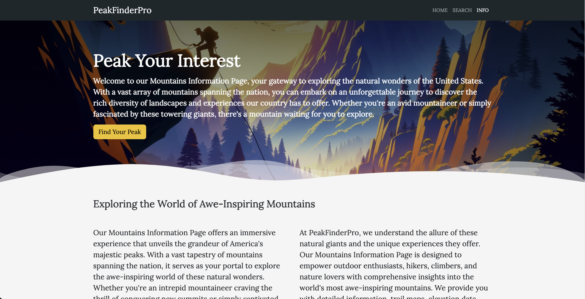
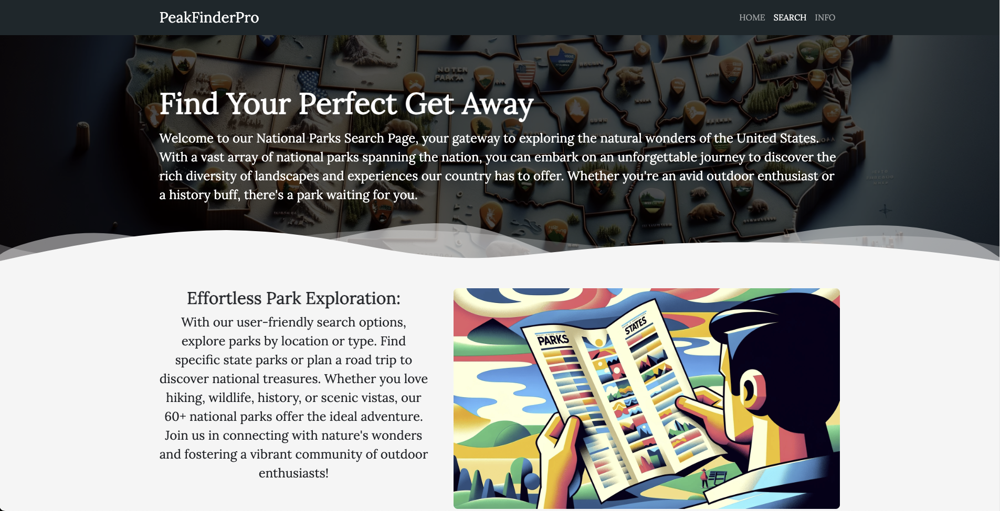

## <a href="https://javirb26.github.io/CapstoneTwo_EnjoyTheOutdoors/">Visit Site</a> 
# CapstoneTwo_EnjoyTheOutdoors

<p align="center" width="100%">
    
  </p>

Description:


## Pages:

### Home Page:
This is the Landing Page for our website, it includes navigation and highlights things people can do to enjoy the great outdoors as well as displays the mission of the organization some more information about the organization and a community testimonial section.

  <p align="center" width="100%">
    
  </p>


### National Park Search Page:

Placeholder Text...

  <p align="center" width="100%">
    
  </p>

### Mountain Information Page:

Placeholder Text...
    <p align="center" width="100%">
        
    </p>
## Interesting Code:

What makes this code interesting is...


```
<h1> hello world </h1>
for (let i = 0; i < 10; i++){
    console.log(i);
}
```