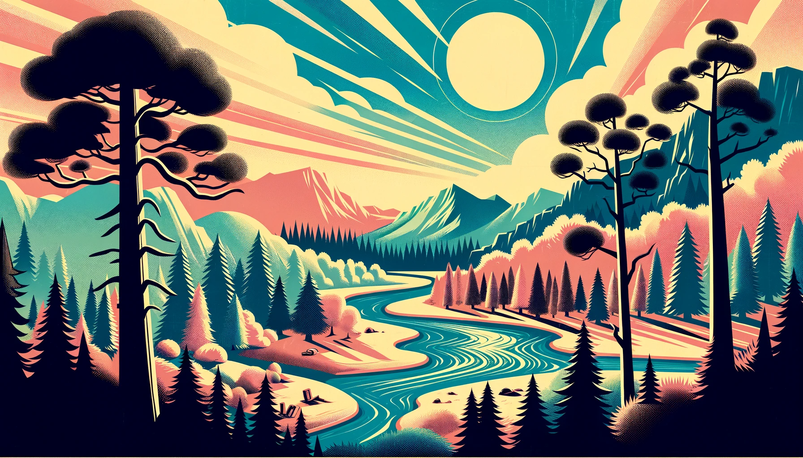

## <a href="https://javirb26.github.io/CapstoneTwo_EnjoyTheOutdoors/">Visit Site</a> 
# CapstoneTwo_EnjoyTheOutdoors

<p align="center" width="100%">
    
</p>


## Description:
This website's mission is to help users find National Parks to visit and allow them to learn about Specific Mountains.

The website was created for the Second Capstone project as a part of YearUp pluralsight LearnToCode Academy.

#### The website contains three pages: 
- ### Home, Park Search, Mountain Info

#### This Website was built using modern web technologies specifically:
- ### HTML, CSS, Bootstrap, and JavaScript


### The Project requirements are:
- Correctly display Select Elements that allow you to search for a national park based on Location or Park Type
- Correctly display a Select Element that allows you to search for a specific mountain based on its name and display information about the mountain chosen.  


## Pages:

### Home Page:

This is the homepage for our website, its organization name is PeakFinderPro. The page is designed to introduce you to the wonders of outdoor exploration. It includes valuable information about majestic mountains, helps you plan your next national park adventure, and provides a platform to connect with like-minded adventurers. 

  <p align="center" width="100%">
    
  </p>


### National Park Search Page:

This is the National Parks Search page it's the portal to discovering the natural wonders of the United States through PeakFinderPro. It introduces you to the world of outdoor exploration, offering valuable insights into national parks, facilitating your next national park adventure, and fostering connections with like-minded adventurers. It contains two select elements which allow you to choose the way you'd like to search for the national parks you're looking for

  <p align="center" width="100%">
    
  </p>

### Mountain Information Page:
This is the Mountains Information page It allows you to select a specific mountain from a wide list and gives you information on the mountain. The page contains some information the organization would like you to know before hand at the top of the page and has a featured mountains section showcasing three of many mountains the page allows you to search for.

<p align="center" width="100%">
    
</p>

## Interesting Code:

(The code below is used in the scripts/mountainInfo.js file)

What makes this code interesting, or at least what caught my attention, was the fact that I could add Bootstrap classes to elements created by the script. This instantly styles the content when it's created. I believe the ability to style within JavaScript is incredible, as styling can truly make or break a web page, in my opinion.


```
 let mountainDescription = mountainsArray.find((desc) => desc.name.includes(selectedMountain));

        if (mountainDescription) {
            mountainContainerEl.classList.add('card');

            let listEl = document.createElement("li");
            // Set mountain name
            listEl.innerHTML = mountainDescription.name;
            // Added BootStrap classes to listEl
            listEl.classList.add('nav-link', 'fs-4', 'mt-4', 'card-title');

            let pElevEl = document.createElement("p");
            // set elevation info
            pElevEl.innerHTML = 'Elevation: ' + mountainDescription.elevation;
            // Added BootStrap class to pElevEl 
            pElevEl.classList.add('mt-3', 'card-text')

            let pEffortEl = document.createElement("p");
            // set effort info
            pEffortEl.innerHTML = 'Effort: ' + mountainDescription.effort;
            pEffortEl.classList.add('mt-3', 'card-text')

            let imgEl = document.createElement("img");
            // set image source
            imgEl.src = 'images/' + mountainDescription.img;
            // Added BootStrap classes to imgEl
            imgEl.classList.add('img-fluid', 'rounded-3', 'mt-4', 'card-img-top');

            let pDescEl = document.createElement("p");
            // set mountain description
            pDescEl.innerHTML = mountainDescription.desc;
            // Added BootStrap classes to pDescEl
            pDescEl.classList.add('fs-4', 'pb-4', 'mt-4', 'text-center', 'card-text')


            // Append newly created elements to listEl
            listEl.appendChild(pElevEl);
            listEl.appendChild(pEffortEl);

            // Append listEl to descriptionEl to populate within HTML
            imgDivEl.append(imgEl);


            mountainDescEl.appendChild(pDescEl);
            descriptionEl.appendChild(listEl);

        }
```